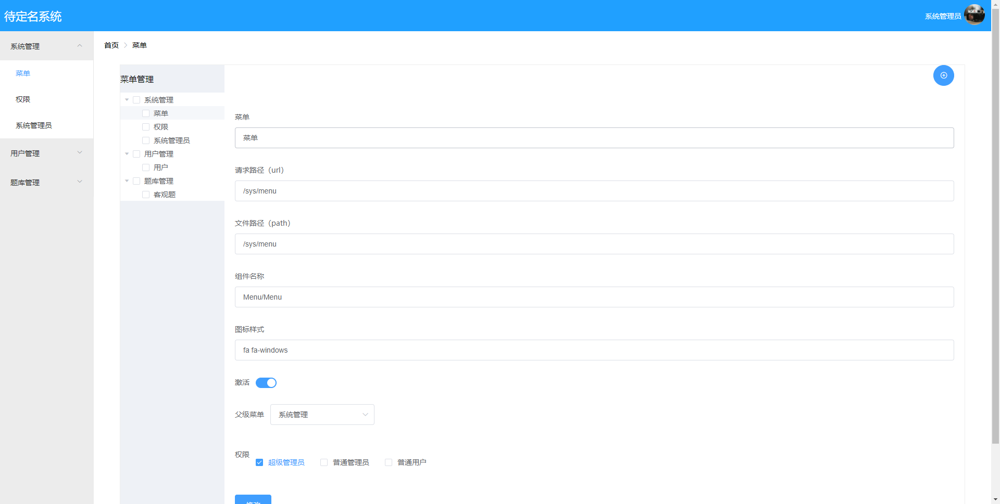
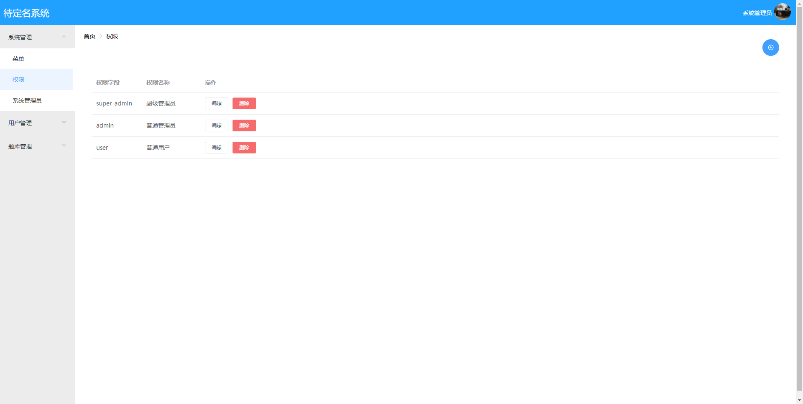
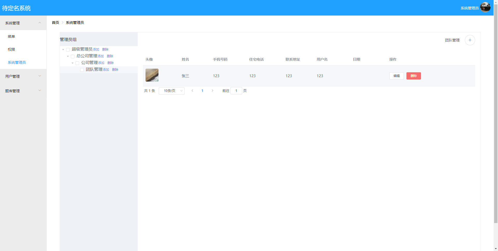
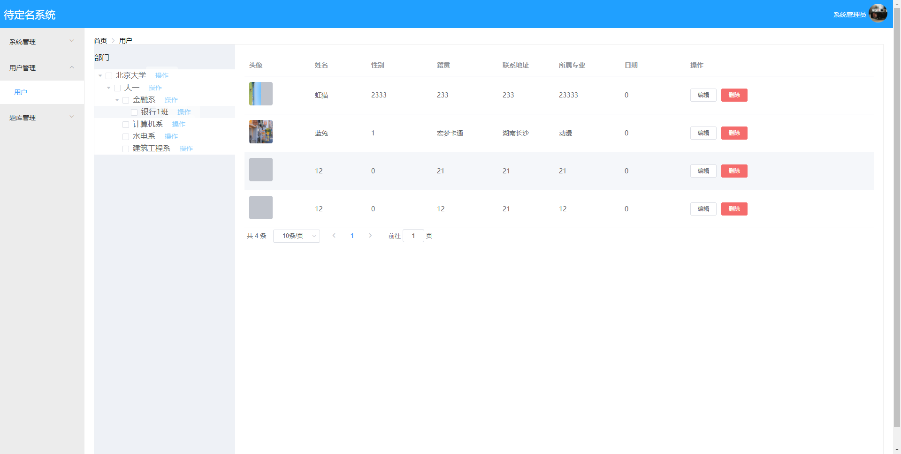

# business

#### 项目简介：

------

​    技术框架 springBoot,spring-security,mybatis-plus,kafka vue+elment,element。功能，菜单管理，权限管理，人员管理。将一般业务系统的登入，权限管理，人员管理抽出，可以作为中小型后端系统快速开发，springboot可当作权限管理模块整合


#### 相关地址：

------

演示地址：http://47.113.206.36 		账号：admin		密码：admin123


前端仓库地址：https://gitee.com/ZXMW/myant.git


#### 项目结构：

------


```
cc.tg
	.client--------------------------  fegin调用接口
	.config--------------------------  项目中的配置类
	.controller----------------------  存放controller类
	.model---------------------------  存放数据传输模型
	.orm-----------------------------  存放实体和mapper接口
	.producer------------------------  kafka消息推送
	.service-------------------------  service接口
		.impl------------------------  service实现
	.tools---------------------------  工具类
	.BusinessApplication.java--------  springboot启动类
```

#### 效果图：

1.登入


2.菜单管理



3.权限



4.用户



5.人员管理

